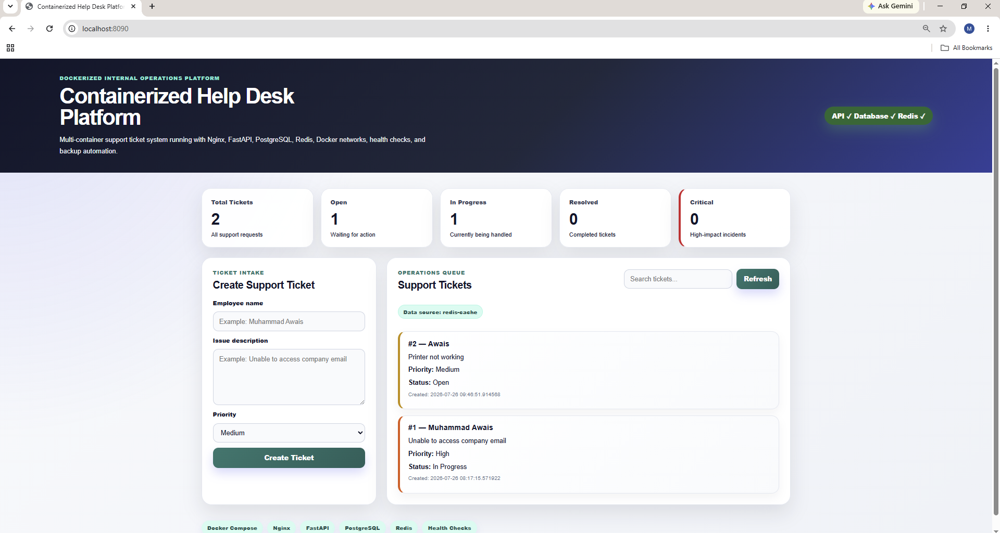
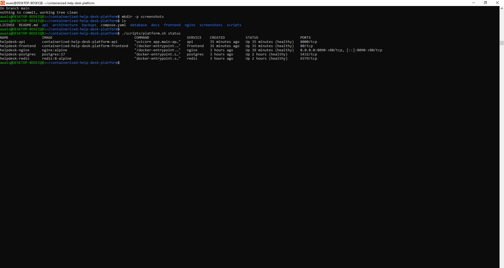
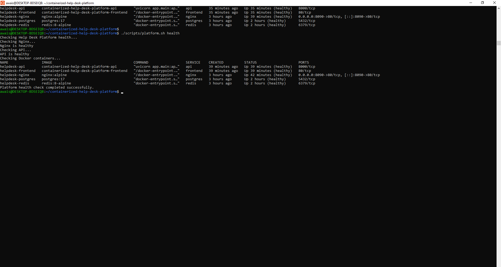
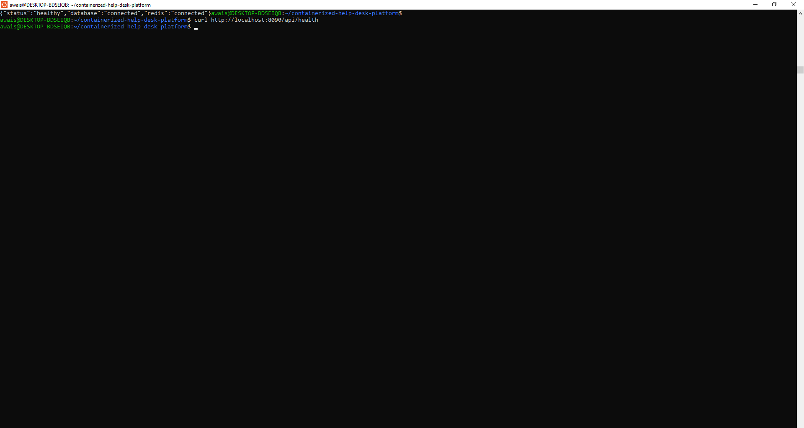
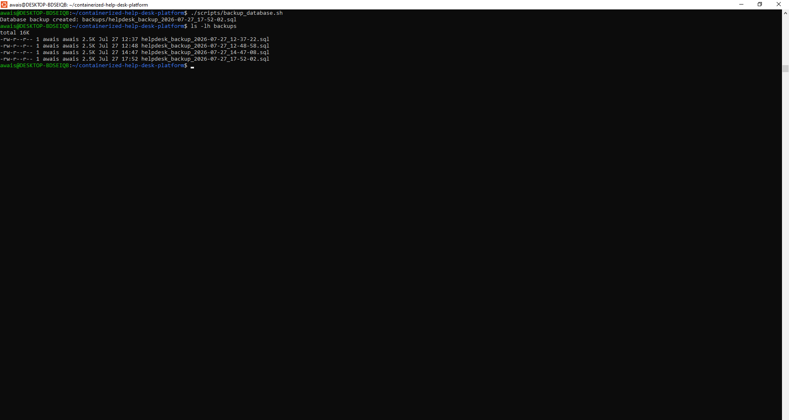

# Containerized Help Desk Platform

A production-style, multi-container Help Desk platform built to demonstrate Docker, Docker Compose, container networking, reverse proxy routing, service health checks, persistent database storage, Redis caching, backup automation, and container operations.

This project is designed as a Cloud & DevOps portfolio project. The application itself is intentionally simple, while the main focus is on containerization, platform engineering, reliability, and operational practices.

---

## Project Overview

The platform provides a simple internal IT support ticket system where users can:

- Create support tickets
- View all tickets
- Search tickets
- Filter tickets by status and priority
- View dashboard statistics
- Store ticket data in PostgreSQL
- Use Redis for cached ticket responses

The full platform runs through Docker Compose using multiple containers.

---

## Architecture

```text
Browser
   |
   v
Nginx Reverse Proxy
   |
   +------------------> Frontend Container
   |
   +------------------> FastAPI Backend Container
                              |
                              +------> PostgreSQL Database
                              |
                              +------> Redis Cache
```

---

## Containerized Services

| Service | Container Name | Purpose |
|---|---|---|
| Nginx | `helpdesk-nginx` | Reverse proxy and single public entry point |
| Frontend | `helpdesk-frontend` | Static web interface served by Nginx |
| API | `helpdesk-api` | FastAPI backend service |
| PostgreSQL | `helpdesk-postgres` | Persistent relational database |
| Redis | `helpdesk-redis` | Cache layer for ticket data |

---

## DevOps Features Implemented

- Multi-container Docker Compose setup
- Nginx reverse proxy
- Private Docker networks
- PostgreSQL persistent volume
- Redis caching layer
- Environment variable based configuration
- `.env.example` for safe configuration sharing
- Health checks for all major services
- Restart policies for container recovery
- CPU and memory resource limits
- Non-root API container user
- Optimized Docker build context using `.dockerignore`
- PostgreSQL backup script
- PostgreSQL restore script
- Platform health check script
- Container logs script
- Platform operations script
- Clean Git commit history

---

## Technology Stack

| Layer | Technology |
|---|---|
| Reverse Proxy | Nginx |
| Frontend | HTML, CSS, JavaScript |
| Backend API | FastAPI |
| Database | PostgreSQL |
| Cache | Redis |
| Containerization | Docker |
| Orchestration | Docker Compose |
| Automation | Bash Scripts |
| Version Control | Git and GitHub |

---

## Project Structure

```text
containerized-help-desk-platform/
├── api/
│   ├── app/
│   │   └── main.py
│   ├── Dockerfile
│   └── requirements.txt
├── database/
│   └── init.sql
├── frontend/
│   ├── Dockerfile
│   ├── index.html
│   ├── style.css
│   └── app.js
├── nginx/
│   └── nginx.conf
├── scripts/
│   ├── backup_database.sh
│   ├── restore_database.sh
│   ├── health_check.sh
│   ├── view_logs.sh
│   └── platform.sh
├── compose.yaml
├── .dockerignore
├── .env.example
├── .gitignore
└── README.md
```

---

## How to Run the Project

### 1. Clone the repository

```bash
git clone <repository-url>
cd containerized-help-desk-platform
```

### 2. Create environment file

```bash
cp .env.example .env
```

Update `.env` values if required.

### 3. Start the platform

```bash
docker compose up -d --build
```

### 4. Open the application

```text
http://localhost:8090
```

### 5. Check platform health

```bash
./scripts/platform.sh health
```

Expected result:

```text
Nginx is healthy
API is healthy
Platform health check completed successfully.
```

---

## API Access

The API is accessed through Nginx:

```text
http://localhost:8090/api
```

Health endpoint:

```bash
curl http://localhost:8090/api/health
```

Expected response:

```json
{
  "status": "healthy",
  "database": "connected",
  "redis": "connected"
}
```

Search tickets by priority:

```bash
curl "http://localhost:8090/api/tickets?priority=High"
```

Search tickets by status:

```bash
curl "http://localhost:8090/api/tickets?status=In%20Progress"
```

---

## Docker Networking

The platform uses two Docker networks:

| Network | Purpose |
|---|---|
| `frontend_network` | Connects Nginx, frontend, and API |
| `backend_network` | Connects API, PostgreSQL, and Redis |

PostgreSQL and Redis are not exposed directly to the host machine. They are only reachable by internal containers through the backend network.

---

## Persistent Storage

PostgreSQL uses a named Docker volume:

```yaml
postgres_data:
```

This keeps database data safe even if the PostgreSQL container is removed or recreated.

---

## Health Checks

Each main service includes Docker health checks.

Check container health:

```bash
docker ps
```

Expected services:

```text
helpdesk-nginx      healthy
helpdesk-frontend   healthy
helpdesk-api        healthy
helpdesk-postgres   healthy
helpdesk-redis      healthy
```

Run platform health script:

```bash
./scripts/health_check.sh
```

---

## Backup and Restore

### Create PostgreSQL backup

```bash
./scripts/backup_database.sh
```

Backup files are created inside:

```text
backups/
```

Backup files are ignored by Git because they may contain real data.

### Restore PostgreSQL backup

```bash
./scripts/restore_database.sh backups/<backup-file>.sql
```

---

## Platform Operations

The project includes a helper script for common operations.

Start platform:

```bash
./scripts/platform.sh start
```

Stop platform:

```bash
./scripts/platform.sh stop
```

Restart platform:

```bash
./scripts/platform.sh restart
```

Check status:

```bash
./scripts/platform.sh status
```

Run health check:

```bash
./scripts/platform.sh health
```

View service logs:

```bash
./scripts/platform.sh logs api
```

Available services:

```text
nginx
frontend
api
postgres
redis
```

---

## Security and Reliability Improvements

This project includes several production-style improvements:

- API container runs as a non-root user
- Database and Redis are private internal services
- `.env` is ignored by Git
- `.env.example` is provided for safe configuration
- Restart policies recover stopped containers
- Health checks detect unhealthy services
- Resource limits prevent excessive container usage
- Backups support data recovery

---

## Useful Docker Commands

List containers:

```bash
docker ps
```

View Compose services:

```bash
docker compose ps
```

View logs:

```bash
docker compose logs api --tail=100
```

Rebuild platform:

```bash
docker compose up -d --build
```

Stop platform:

```bash
docker compose down
```

Inspect API resource limits:

```bash
docker inspect helpdesk-api --format='Memory={{.HostConfig.Memory}} NanoCPUs={{.HostConfig.NanoCpus}}'
```

Check API user:

```bash
docker exec helpdesk-api whoami
```

Expected:

```text
appuser
```

---

## Screenshots

### Application Dashboard



### Healthy Docker Containers



### Platform Health Check



### API Health Through Nginx



### PostgreSQL Backup Automation



---

## What I Learned

Through this project, I practiced:

- Designing a multi-container Docker Compose platform
- Connecting services through private Docker networks
- Using Nginx as a reverse proxy
- Running PostgreSQL with persistent storage
- Adding Redis caching
- Managing configuration with environment variables
- Writing operational Bash scripts
- Adding Docker health checks and restart policies
- Running containers with improved security
- Validating and troubleshooting a containerized platform

---

## Portfolio Summary

This project demonstrates the ability to containerize and operate a realistic multi-service application using Docker and Docker Compose. It focuses on DevOps responsibilities such as orchestration, networking, service reliability, configuration management, backup automation, monitoring, and operational readiness.

---

## License

This project is licensed under the MIT License.

See the [LICENSE](LICENSE) file for details.

---

## Author

**Muhammad Awais**

Cloud & DevOps Engineer

GitHub: [awais-clouddev](https://github.com/awais-clouddev)

⭐ If you found this project useful, consider giving it a star.
